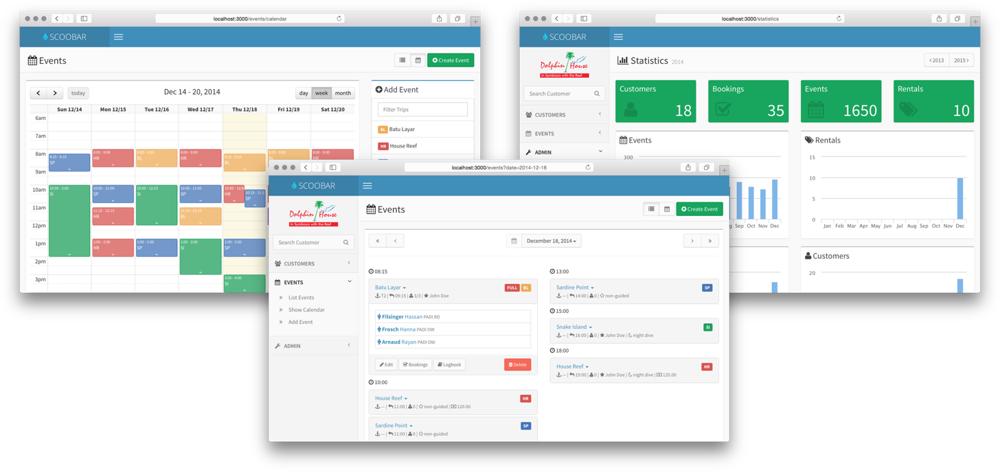

# SCOOBAR [](https://semaphoreapp.com/hwuethrich/scoobar) [](https://codeclimate.com/github/hwuethrich/scoobar) [](https://codeclimate.com/github/hwuethrich/scoobar)

*Simple and easy management application for your SCUBA dive center - built with love and [Ruby on Rails](http://rubyonrails.org).*


[](doc/screenshots)

## Features

Please note that this project is still WIP and the following features are still quite basic. But we have to begin somewhere, right?!

* **Customer management and billing**
* **Event planning and booking**
* **Equipment and rentals**
* **Statistics and reports**

### Planned features

* Allow user to change branding (logo)
* Authentication
* Extend billing with taxes, discounts...
* Customer checkin/checkout

📢 *If you have specific feature requests, feel free to [report](https://github.com/hwuethrich/scoobar/issues/new) them!*

### Screenshots & Demo
	
* Screenshots can be found [here](doc/screenshots/).
* Feel free to checkout the demo: [http://scoobar.herokuapp.com](http://scoobar.herokuapp.com)

## Gettings started


### Requirements

* Ruby 2.x
* PostgreSQL 9.x

**Other versions might work as well.**

### Installation

```
git clone https://github.com/hwuethrich/scoobar.git
```

Run the setup script to install required gems and setup the database. Then run the server:

```
cd scoobar
./bin/setup
./bin/rails server
```

Access your application at [http://localhost:3000](http://localhost:3000).


## Contributing

Like this project? There are several ways to contribute:

1. Give feedback and report [bugs](https://github.com/hwuethrich/scoobar/issues) 
2. Contribute bugfixes and features by forking this project and sending pull requests on [Github](https://github.com/hwuethrich/scoobar).

## ❤️ Thanks and credits

* Thanks to the people at the wonderful **[Dolphine House Moalboal](http://moalboal.net/moalboal/)** resort for sponsoring the initial work on this project!
* Thanks to [Almsaeed Studio](http://www.almsaeedstudio.com/) for the amazing [theme](https://github.com/almasaeed2010/AdminLTE).

## License

SCOOBAR is released under the MIT License.
